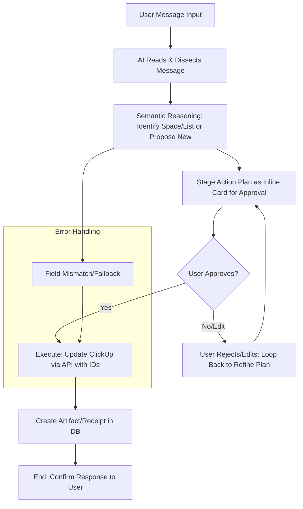

```markdown
# APP_LOGIC_ARCHITECTURE.md
**Life OS AI - Core App Logic & Reasoning Structure**  
*Version 1.0 | Last Updated: February 19, 2026*  
*Single source of truth (SSOT) for how the AI processes user messages, dissects requests, maps to ClickUp structures, handles creations, stages actions for approval, executes via API, and creates artifacts. This replaces rigid life area detection with flexible semantic reasoning for space/list identification. Use this as the blueprint for redesign implementation in Codex.*

## Migration Override (2026-02-26)
- Calendar-first execution is now authoritative.
- `chat` stages a normalized plan (`mode=calendar_description|clickup_task`) and executes calendar on approval.
- ClickUp tasks execute only when explicitly selected.
- This document remains useful for UX intent flow, but execution authority is defined in `src/architecture_SSOT/05_execution_rules/05_execution_rules.md`.

## Core Principles
- Prioritize semantic reasoning over brittle rules for identifying spaces/lists—use embeddings and LLM chain-of-thought for robust, "real thinking" matching.
- Always stage action plans as inline cards for user approval before execution to prevent errors (e.g., title vs. ID mismatches).
- On approval: Execute to ClickUp using IDs (never titles), then create artifact/receipt in DB for auditability.
- Focus on user agency: Approval step ensures transparency and control.
- Handle new creations (spaces, lists, fields) only on explicit request or clear semantic need, with mandatory approval.
- Safeguard against API issues: Use dynamic field fetching/validation; fallback unmapped data to descriptions/comments.

## Visual Flowchart (Mermaid – Render for Visualization)


## Detailed Breakdown of Flow

### 1. User Message Input
- Capture raw text/voice input + metadata (user_id, timestamp, device).
- Normalize (e.g., transcribe voice, clean rambling).

### 2. AI Reads & Dissects Message
- Parse intent semantically (e.g., LLM prompt: "Extract core request, entities, actions from: [message]").
- Identify potential ClickUp operations (e.g., create/update task, query data, create structure).

### 3. Semantic Reasoning for Space/List Identification
- Fetch synced spaces/lists from DB (no rigid 'life areas'—treat as flat hierarchy).
- Use embeddings/RAG for matching:
  - Embed query (e.g., "update dinner macros" → nutrition-related).
  - Search DB spaces/lists (cosine similarity >0.75 on names/descriptions/custom fields).
  - LLM validates/refines: "Based on matches, select best space/list ID or propose new if none fit."
- If no match: Propose new (e.g., "No suitable list—create 'Bike Prep' in Fitness Space?").
- Output: { space_id, list_id } or proposal JSON.
- Emphasis: Robust, "real thinking" via chain-of-thought—avoid brittle keywords; consider context/goals.

### 4. Stage Action Plan as Inline Card
- Generate JSON plan: { summary: "Update task XYZ with new macros", changes: { due_date: "...", custom_fields: {...} }, target: { space_id: "...", list_id: "..." } }.
- Render inline UI card: Show plan in chat (e.g., "Proposed: [summary]. Targets: List ABC (ID: 123). Approve / Edit / Cancel").
- For new creations: Include proposed name, fields, parent_id.

### 5. User Approval
- Wait for response (Approve → proceed; Edit → refine plan/loop back; Cancel → end).
- High-risk plans (e.g., deletes) auto-require approval.

### 6. Execute to ClickUp via API
- Use IDs only (from sync/DB)—never titles in payloads.
- Dynamic field handling:
  - GET /list/{list_id}/field to validate/fetch latest IDs/types.
  - If mismatch/missing: Fallback value to description/comments or propose creation.
- Examples:
  - Update Task: PUT /task/{id} { custom_fields: [{id: "uuid", value: 45}] }
  - Create Task: POST /list/{id}/task
  - Create List: POST /space/{space_id}/list
  - Create Field: POST /list/{id}/field { name: "Protein g", type: "number" }

### 7. Create Artifact/Receipt in DB
- Insert into artifacts table: { timestamp, user_input, plan_json, clickup_response_json, metadata: { task_id, changes_made } }.
- Use as receipt for debugging/reports.

### 8. End: Response to User
- Confirm: "Action executed—view in ClickUp [link]. Artifact stored."

## Implementation Notes for Codex
- Sync DB always provides IDs—enforce in code.
- Semantic reasoning: Use cosine + LLM for non-brittle matching.
- Inline card: Build as React/Vue component in chat UI.
- Error Fallbacks: Description dump on mismatch; log all to artifacts.

This is the redesigned architecture—implement based on this SSOT.
```
