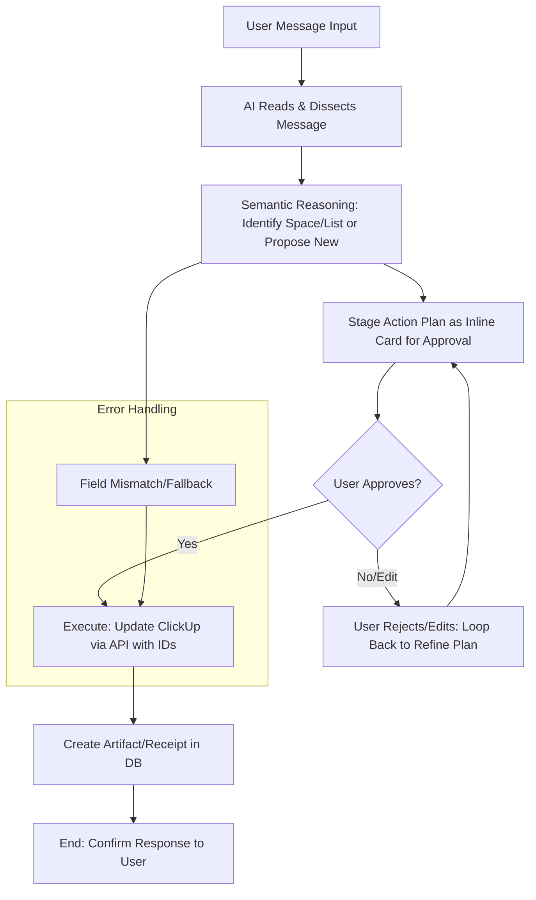

# APP_LOGIC_ARCHITECTURE.md
**Life OS AI - Core App Logic & Reasoning Structure**  
*Version 1.0 | Last Updated: February 19, 2026*  
*Single source of truth (SSOT) for how the AI processes user messages, dissects requests, maps to ClickUp structures, stages actions for approval, executes via API, and creates artifacts. This replaces brittle life-area detection with flexible semantic reasoning for space/list identification. Use this as the blueprint for the redesign implementation in Codex.*

## Core Principles
- Prioritize semantic reasoning over brittle rules for identifying spaces/lists—use embeddings and LLM chain-of-thought for robust, “real-thinking” matching.
- Always stage action plans as inline cards for user approval before execution to prevent errors (e.g., title vs. ID mismatches).
- On approval: execute to ClickUp using IDs (never titles), then create an artifact/receipt in the database for auditability.
- Focus on user agency: the approval step ensures transparency and control.
- Handle new creations (spaces, lists, custom fields) only on explicit request or clear semantic need, with mandatory confirmation.
- Safeguard against API issues: dynamically fetch and validate custom fields; fallback unmapped data to descriptions/comments.

## Visual Flowchart (Mermaid – Render for Visualization)

## Detailed Breakdown of Flow

### 1. User Message Input
- Capture raw text/voice input plus metadata (user_id, timestamp, device).
- Normalize (e.g., transcribe voice, clean rambling speech).

### 2. AI Reads & Dissects Message
- Parse intent semantically via LLM prompt (“Extract core request, entities, actions from [message]”).
- Identify possible ClickUp operation types: create/update/delete/query/report/orient.

### 3. Semantic Reasoning for Space/List Identification
- Fetch synced spaces/lists from the database (no rigid life-area labels—treat as a flattened hierarchy).
- Use embeddings/RAG matching:
  - Embed the user query.
  - Embed each space/list name/description/custom fields.
  - Apply cosine similarity (threshold ~0.75) to find best matching target.
  - Let the LLM validate or propose a new list/space when no match exists.
- Outputs: {space_id, list_id} or {proposed_structure} JSON.
- Emphasize non-brittle chain-of-thought reasoning rather than keyword heuristics.

### 4. Stage Action Plan as Inline Card
- Build a plan object: {summary, targets, proposed_changes, custom_fields, type}.
- Render inline UI card with approve/edit/cancel options within the chat.
- For creation proposals include name, parent_id, suggested fields.

### 5. User Approval
- Wait for user confirmation; high-risk plans (deletions, structure-wide changes) always require it.
- If user edits, loop back to step 2 with updated intent.

### 6. Execute to ClickUp via API
- Use IDs only (from sync or newly created resources)—never rely on titles.
- For custom fields: GET /list/{list_id}/field to validate current schema.
- On mismatch: fallback to description/comment or propose creating the missing field.
- Example payloads:
  - Update task: PUT /task/{id} with custom_fields array.
  - Create task: POST /list/{list_id}/task with assignees/dates/custom_fields.
  - Create list: POST /space/{space_id}/list (or /folder/{folder_id}/list).

### 7. Create Artifact/Receipt in DB
- Insert record: {timestamp, user_input, plan_json, clickup_response, metadata (task_id, changes)}.
- Use this artifact for auditing, debugging, or reports.

### 8. End: Response to User
- Confirm execution (“Action complete—task updated in ClickUp. Artifact recorded.”).
- Optionally provide orientation insight or next suggested actions.

## Implementation Notes for Codex
- Keep ClickUp sync running so the DB always knows the latest IDs.
- Use embeddings + LLM prompts to reason about spaces/lists, not rigid life areas.
- Inline cards must summarize the plan clearly before execution.
- Log everything to artifacts for traceability and debugging.
